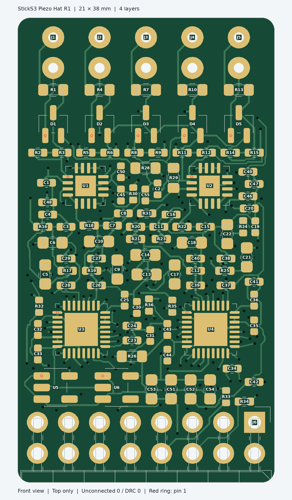

# M5basspiezohat

M5StickS3のHat2に接続する、ベース用の5チャンネル・ピエゾ入力基板。弦ごとの独立したピエゾ信号を高入力抵抗のバッファと音声ADCで処理し、TDMで本体へ送る。

本体での音程検出とUSB MIDI出力を想定したハードウェア設計で、ファームウェアは未実装。基板は実機未検証のR1試作版。

```text
独立ピエゾ ×4〜5 → 保護・バッファ・LPF → ES7210 ×2
                                      → TDM → M5StickS3
                                               → 音程検出・USB MIDI（未実装）
```

## 仕様

| 項目 | R1 |
| --- | --- |
| 接続先 | M5StickS3 Hat2 |
| 入力 | 独立ピエゾ最大5チャンネル、内部SIG/GNDはんだパッド |
| ADC | ES7210×2、TDMカスケード接続 |
| 電源 | Hat2 EXT_5V、基板内でアナログ／デジタル3.3Vを生成 |
| 基板 | 21×38×1.0mm、4層、四隅R1mm |
| 実装 | 表面PCBA 96点。裏面は裸銅箔テストパッド4点 |
| 手実装 | 保護ダイオードD1〜D5、ヘッダJ6、ピエゾ配線 |
| 筐体の設計範囲 | Hat単体・コネクタ込み48×24×15mm以内 |



## 設計データの利用

1. [基板仕様・接続表](hardware/sticks3-piezo-hat/README.md)で電源、Hat2端子、ピエゾ入力を確認する。
2. KiCad 9で [プロジェクト](hardware/sticks3-piezo-hat/sticks3-piezo-hat.kicad_pro)を開く。[回路図](hardware/sticks3-piezo-hat/sticks3-piezo-hat.kicad_sch)と[配線済み基板](hardware/sticks3-piezo-hat/sticks3-piezo-hat.kicad_pcb)が編集元。
3. 製造には [JLCPCB用データ一式](hardware/sticks3-piezo-hat/release/PCBA_JLCPCB.zip)と[製造・組立手順](hardware/sticks3-piezo-hat/manufacturing.md)を使用する。BOM、CPL、手実装部品の一覧を含む。
4. 変更後は[再生成・検査手順](hardware/sticks3-piezo-hat/README.md#ソースと再生成)に従い、製造データを再出力する。

## 検証状況

KiCad 9.0.9で未接続0件、DRC違反0件、ERC違反0件。回路図・基板・設計マニフェストの318接続を照合済み。[検査記録](hardware/sticks3-piezo-hat/validation.md)を参照。

Hat2ヘッダの嵌合、TDM取得、Low Bまでの周波数応答、弦間の振動漏れ、音程検出の遅延は未検証。[ファームウェア設計・評価手順](docs/firmware-design.md)に取得条件と評価項目を記載している。USB MIDIを使用する接続先にはUSBホスト機能が必要。

[筐体モデル](mechanical/sticks3-hat-concept.md)は寸法・保持構造の検討用。蓋と下端受けの固定方法、ケーブル出口は未設計。

## ファイル構成

| ディレクトリ | 内容 |
| --- | --- |
| `hardware/sticks3-piezo-hat/` | KiCad編集元、プロジェクト内ライブラリ、BOM、生成・検査ツール |
| `hardware/sticks3-piezo-hat/release/` | Gerber、PCBA用BOM/CPL、組立位置図、製造用ZIP |
| `mechanical/` | Blender筐体検討モデル、寸法計算、生成スクリプト |
| `docs/` | ファームウェア設計と評価手順 |

## ライセンス

KiCad由来のライブラリとモデルの出典・ライセンスは [NOTICE.md](NOTICE.md) を参照。プロジェクト独自部分の利用ライセンスは未指定。
