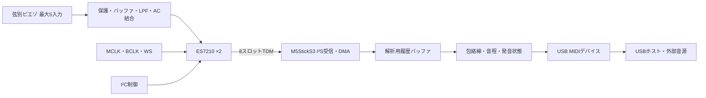

# ファームウェア設計・評価手順

M5StickS3でES7210×2のTDM音声をDMA受信し、弦別の音程をUSB MIDIへ変換するための設計資料。ファームウェアは未実装。以下の取得条件・遅延目標は計算と資料に基づく評価開始値で、実測値ではない。

## 信号経路

R1基板は4弦・5弦ともADCを2個搭載する。受信8スロットのうち、接続した4〜5入力を解析対象とする。物理入力とスロットの対応、未使用ADC入力の処置・出力配置は評価時に確認する。

配線・ピン番号は [基板仕様](../hardware/sticks3-piezo-hat/README.md#hat2接続) を参照。

## 電源と初期化

M5Unifiedの本体初期化後に `M5.Power.setExtOutput(true)` でHat2 EXT_5Vを有効にする。GPIO信号は3.3V。出力モードのEXT_5Vへ別電源を接続しない。電源・表示の初期化後にADCクロックと受信を開始する。[M5StickS3資料](https://docs.m5stack.com/en/core/StickS3)

ESP-IDF、esp_codec_dev、M5ライブラリの版を固定する。内蔵音声機能とのI²Sポート競合を避け、外部ADC用の受信ポートを明示的に確保する。U3／U4の想定7bit I²Cアドレスは0x40／0x41。U4の割り込み出力はNCのため、ADC割り込みは無効にする。

## TDMカスケード

U3とU4に共通MCLK・BCLK・WSを供給する。U3 TDMOUT→33Ω→U4 TDMIN、U4 TDMOUT→33Ω→Hat2 DATAへ接続する。

ES7210 Rev.21資料の0x08入力数設定、0x11語長・プロトコル設定、0x12出力モード・最終段指定を使い、8入力・16bit・カスケード設定を評価する。レジスタ値の一式は購入品のリビジョン、接続、クロックに合わせて確定する。

[ES7210レジスタ資料](https://files.waveshare.com/wiki/common/ES7210_DS.pdf)と[M5Stack公開版データシート](https://m5stack.oss-cn-shenzhen.aliyuncs.com/resource/docs/datasheet/core/K128%20CoreS3/ES7210.PDF)は記載に差があるため、購入品と対応資料を照合する。[Espressifの4入力TDM例](https://github.com/espressif/esp-idf/blob/master/examples/peripherals/i2s/i2s_codec/i2s_es7210_tdm/main/i2s_es7210_record_example.c)を単体取得の参考とし、2個カスケードの設定は別に検証する。

## 取得レートとDMA

| 設定 | 単体ADC評価 | 2個カスケード評価 |
| --- | ---: | ---: |
| サンプルレート | 16kS/s | 16kS/s |
| スロット数 | 4 | 8 |
| スロット語長 | 16bit | 16bit |
| BCLK計算値 | 1.024MHz | 2.048MHz |
| MCLK評価値・256fs | 4.096MHz | 4.096MHz |
| 1ブロック | 32フレーム・2ms | 32フレーム・2ms |
| DMAバッファ数 | 8 | 8 |
| DMA容量 | 2048B・16ms分 | 4096B・16ms分 |

計算式は `BCLK=fs×スロット数×語長`、`DMA容量=フレーム数×スロット数×語長/8×バッファ数`。ADCのBCLK比・フレーム形式とESP32-S3側の設定を一致させ、実際のレートをロジックアナライザで測定する。

受信済みブロックは2msごとに回収して解析へ渡す。DMAの保持容量16msと、1ブロックの待ち時間0〜2msは区別する。DMA領域は内部のDMA対応RAMに確保し、解析履歴・作業領域は別に確保する。PSRAMは長い評価波形や表示データに使用する。取得停止時間と平均処理速度を監視し、オーバーフローを記録する。[Espressif I²S・TDM・DMA仕様](https://docs.espressif.com/projects/esp-idf/en/stable/esp32s3/api-reference/peripherals/i2s.html)

## 前段と低域評価

前段は20MΩ入力バイアス、TLV9064利得1、1kΩ／47nFの受動2段LPF、10µF AC結合。ADC PGAは低い固定利得から評価する。

ピエゾ容量と負荷抵抗、AC結合、ADC内部HPFの応答を合わせて測定する。例としてCp＝1nF、R＝20MΩの簡略モデルではカットオフ約7.96Hz。入力回路全体の10〜100Hz応答を測り、Low B＝30.87Hzの減衰を評価する。AC結合容量は実効容量とADC利得依存の入力抵抗を考慮する。[TIピエゾ信号調整](https://www.ti.com/lit/an/sloa033a/sloa033a.pdf)

HPF係数・オフセット補正は低域減衰と過負荷回復を測定して決定する。既存のマイク向け設定を用いる場合は、利得と補正がピエゾの最大アタック、弱音、Velocityへ及ぼす影響を確認する。

## 処理タスク

| タスク | 処理・記録 |
| --- | --- |
| 取得 | DMA回収、受信量、ブロック連番、オーバーフロー |
| 前処理 | 入力別DC成分、クリップ、包絡線、必要なLPF・間引き |
| 音程 | YIN系・自己相関を比較。弦別音域と前回周期で探索範囲を制限 |
| 発音状態 | アタック、確信度、再ピッキング、ミュートからNote On／Offを判定 |
| MIDI | イベントキューからNote On／Off・Velocityを送信 |
| 表示・設定 | 低頻度更新。評価中のFlash書き込みによる取得停止を計測 |

全入力を取得し、単音判定から複数弦同時判定へ評価を進める。必要に応じて解析用レートを8kS/s程度へ間引く。CPU使用率、最大RAM、解析時間を入力数ごとに計測する。

Low B周期は約32.4ms、E1周期は約24.3ms。MIDI送信までの初期評価目標はLow B45〜80ms、E1 35〜60ms。ADCフィルタ、DMA待ち、周期観測、USB送信、音源側の発音を分けて測定し、中央値・95パーセンタイル・オクターブ誤り・余分なNote Onを記録する。

## USB MIDI

本体USB-CでUSB MIDIデバイスを実装する。接続先はPC、USB MIDIホスト、またはUSBホスト機能を持つ音源。USBデバイス端子同士では直接接続できない。[Espressif USB MIDI例](https://github.com/espressif/esp-idf/tree/master/examples/peripherals/usb/device/tusb_midi)

Note On／Off・Velocityを基本とし、Pitch Bendは音源のチャンネル設定と対応範囲を確認して評価する。R1基板はDIN MIDI出力回路を搭載していない。

## 評価手順

| 段階 | 確認項目 |
| --- | --- |
| 電源・接続 | ヘッダ方向、GND／EXT_5V、3V3A／3V3D、VMID、I²Cアドレス |
| USB MIDI | 固定ノートで接続先音源を発音できる |
| ADC単体 | 4スロット受信、既知周波数と入力の対応、実サンプルレート |
| DMA負荷 | 2msブロックで10分間。表示・USB MIDI同時動作で欠損を記録 |
| ADCカスケード | 8スロット受信、5入力の割り当て、ADC間遅延、再起動後の再現性 |
| ピエゾ入力 | 容量・振幅、10〜100Hz応答、最大アタック、無給電時の回り込み |
| MIDI変換 | 遅延、誤発音、弦間漏れ、CPU使用率、最大RAM |

カスケード評価では各入力へ異なる既知周波数を入れ、スロット対応を確認する。同一信号を両ADCへ入力し、固定遅延・チャンネルずれ・再投入後の再現性を測定する。評価結果に応じた回路変更後は、基板検査と製造データの再出力を行う。
