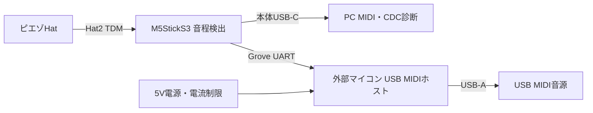

# Grove接続の外付けUSB MIDIホスト

M5StickS3のUSB-CをUSB MIDIデバイス＋診断CDCのまま維持し、Groveへ独立したUSB MIDIホスト基板を接続する構成案。ピエゾHat R1の回路・配線を変更せず、音源用USB端子と給電制御を外部基板に分離できる。外部基板・Grove送信ファームウェアは未実装。本資料は接続方式と部品候補の調査記録。

## 接続

StickS3のGroveはGND、5V、GPIO9、GPIO10。[本体PinMap](https://docs.m5stack.com/en/core/StickS3#hy2.0-4p)を参照。コネクタはHY2.0-4P。配線案は以下。

| 線 | 本体 | 外部基板 |
| --- | --- | --- |
| 黒 | GND | GND |
| 赤 | EXT_5V | 電源入力、外部電源からの逆流を防止 |
| 黄 | GPIO9 / UART TX | マイコンUART RX |
| 白 | GPIO10 / UART RX | マイコンUART TX |

信号は3.3V。電源が5VでもGPIOへ5V信号を入れない。外付けマイコンがUSB列挙・MIDIクラス・転送・VBUS給電を担当し、本体は発音イベントと状態確認だけを送る。SPI USBホストICを4線Groveへ直接つなぐ構成ではない。

初期検証はUART 31250baud / 8N1の標準MIDIストリームが使いやすい。3byteのNote Onは線上で0.96ms、5弦分は4.8ms。これはUARTの計算値で、USBとキュー遅延を含まない。Pitch Bendを高頻度で送る場合は帯域を確認する。製品用には高速UART、長さ・連番・CRC付きイベント、送信ACK、相手の接続状態、Panicとハートビートを設ける。1Mbpsで4byteペイロードだけなら40µs、フレームのヘッダ等は別に加算する。

I²C 400kHzも候補だが、USB処理待ちをclock stretchingで本体へ伝えないよう、外部基板内にキューと状態レジスタを設ける。Groveは外部ADCのGPIO4／5とは別系統だが、本体内部バスと合わせてI²Cポート・ドライバの割り当てを確認する。UARTなら既存の内部／外部I²Cを変更せずに済む。

## 候補

| 候補 | 評価 |
| --- | --- |
| RP2040＋USB-A＋保護付き5V | USB Host/Deviceを内蔵。USB MIDIホスト↔UARTの公開実装があるため、試作の第一候補。外付けQSPI Flashが必要 |
| CH32V203C8T6＋USB-A＋保護付き5V | USB Host/DeviceとFlash内蔵。低コスト量産候補。MIDIクラスとUARTプロトコルの実装・検証が必要 |
| Adafruit Feather RP2040 USB Host | USB-Aと5V昇圧・ヒューズを備える開発基板。Grove直結製品ではなく、UARTへの変換配線と専用ファームウェアが必要。56.3mm長でHatの48mm上限を超える |
| M5Stack Module USB / MAX3421E | SPI接続。通常のGroveケーブルだけでは必要信号を確保できない |
| M5Stack Unit MIDI | Grove UARTでDIN MIDIと内蔵音源を扱う。USB MIDIホスト端子はない |

RP2040は [LCSC C2040](https://www.lcsc.com/product-detail/C2040.html)、CH32V203C8T6は [LCSC C3001172](https://www.lcsc.com/product-detail/C3001172.html)で掲載を確認。2026-10-06のページ表示はRP2040が1個約$1.00、CH32V203C8T6が約$0.83。価格・在庫・JLCPCBでのPCBA利用可否は発注時に再確認する。マイコン価格だけでなく、Flash・水晶・USB端子・給電保護・実装費・ファームウェア開発費を含めて比較する。

RP2040のUSB仕様は [Raspberry Pi公式仕様](https://www.raspberrypi.com/products/rp2040/specifications/)。UARTとUSB MIDIを橋渡しする実装例は [midi2usbhost](https://github.com/rppicomidi/midi2usbhost)。CH32V203のUSB機能と評価ソースは [WCH公式リポジトリ](https://github.com/openwch/ch32v20x)。小ピン数品はUSBホストに使う端子が出ているか型番ごとに確認し、シリーズ共通の紹介だけで選ばない。

[Adafruit製品](https://www.adafruit.com/product/5723)はPIOを使った別USB-Aホストを持ち、昇圧と500mAヒューズを備える。試作には参考になるが、5Vの接続先は同基板の電源回路に合わせる。[M5Stack Module USB](https://docs.m5stack.com/en/module/usb)はSPI、[Unit MIDI](https://docs.m5stack.com/en/unit/Unit-MIDI)はUART/DIN。

## 電源・端子

最初はUSB-Aのホスト端子を採用する。USB-Cをホスト用に使う場合はCCのRp、必要な役割・電力制御を外部基板側で実装する。本体USB-Cの固定Rdをソフトウェアで切り替える必要がなくなる。

Grove 5Vは無制限ではない。本体資料の負荷測定は4.88V @ 0.38Aで、これをUSB音源へ500mA供給できる保証として扱わない。ピエゾHatと外部マイコンの消費も測定し、許容範囲を決める。バス給電音源を広く扱うなら、外部基板へ独立した5V入力を設ける。

USB VBUSには電流制限、短絡保護、逆流対策と必要な容量を設ける。外部5VとGrove 5Vを直結せず、外部入力から本体の出力端子へ電流が戻らない構成とする。過電流時はUSB給電を停止し、本体へ異常を報告する。

## ファームウェアの分担

| 本体 | 外部基板 |
| --- | --- |
| ADC/TDM、音程、Velocity、Note状態 | USBデバイスの列挙、MIDI OUT発見、転送 |
| 本体USB MIDI＋CDC | USB VBUS制御、過電流状態 |
| Groveイベント送信、出力先選択 | UART受信キュー、ACK、接続状態返信 |
| 外部切断時のNote状態リセット | UART無通信・リセット・USB再接続時のPanic |

本体USBの役割切り替えに追加して、出力先を `本体USB`／`Groveホスト`／`両方` として管理する構成が考えられる。片側のキュー不足が他方のNote Offを失わせないよう、出力先ごとに状態と再接続世代を管理する。外部基板のUSB・UARTの双方を最初に検証してから、本体の出力先選択を実装する。

USB MIDI音源を鳴らす用途では、外部基板は音程検出を担当せず、高性能なH7級マイコンを必要とする構成ではない。必要なのはUSBホスト機能とMIDIクラスの実装、イベントを保持できるメモリ、確実な給電制御である。
