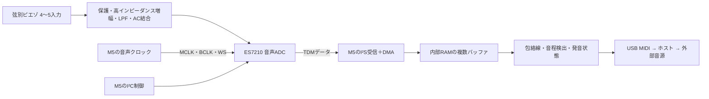

# 音声ADC＋TDM＋DMAで作るM5Stackベース MIDI変換器

更新日：2026年10月6日。ユーザーが音声ADC＋I²S／TDM＋DMA方式を採用する意向を示したため、この方式を本命として計画を更新した。現在はStickS3のHat2へ直結し、Hat単体をコネクタ込み48×24×15mm以内、全部品を片面実装とする。入力は弦別4〜5ピエゾ、ケース内部のはんだパッド接続、出力は外部音源へのMIDI。Cardputer ADV対応は別アダプタの拡張案とする。

基板設計は21×38mm・4層・片面実装で配線を完了した。未接続0件、DRC／ERC各0件、表面PCBA96点。製造データは [release/](hardware/sticks3-piezo-hat/release/README.md)、編集用基板は [KiCad PCB](hardware/sticks3-piezo-hat/sticks3-piezo-hat.kicad_pcb)。

**採用方針：高インピーダンス前段＋ES7210音声ADC＋M5本体のTDM受信／DMA＋音程検出＋USB MIDI。周辺基板にはマイコンを追加しない。** ADC型番、入力定数、2個接続の設定は試作で確定する。以下の数値は資料と計算による設計案で、実機の取得・解析・遅延は未測定。

## 1. 構成

4弦用はES7210を1個、5弦用は2個接続して8入力分を受信する案。5弦用は必要な5入力だけを音程解析する。未使用入力の処置・無効化後の出力配置はデータシートと実測で確認する。

ADCの連続出力をM5のI²Sペリフェラルが受け、DMAがRAMへ保存する。CPUは数ms単位のブロックを処理する。大容量のADC内FIFOがなくても、本体の複数DMAバッファで取得と解析を分離できる。バッファは有限なので、取得タスクの停止や平均処理速度の不足による欠損は検出する。[Espressif I²Sドライバ・DMA](https://docs.espressif.com/projects/esp-idf/en/stable/esp32s3/api-reference/peripherals/i2s.html)

## 2. 部品候補と調達

| 部品 | 使用数案 | 役割・調達情報 |
| --- | ---: | --- |
| **ES7210・Everest Semiconductor** | 4弦：1個、5弦：2個 | 4入力音声ADC、TDM対応。[LCSC C365743](https://www.lcsc.com/product-detail/C365743.html)。今回の閲覧表示：30,611個、US$0.9057／個・1個〜 |
| TLV9064IRTER・TI | 2個 | 3×3mm WQFN。初段5回路＋中点1回路、残り2回路は入力を固定。[C882406](https://www.lcsc.com/product-detail/C882406.html)。閲覧時US$0.8868／個・1個〜。LPFは受動RCへ変更 |
| AP2112K-3.3TRG1・DIODES | 1〜2個 | アナログ／デジタル3.3V電源の候補。[C51118](https://www.lcsc.com/product-detail/C51118.html)。今回の表示：US$0.1726／個・最低5個 |
| 受動部品・入力保護 | 5入力分 | 高抵抗バイアス、低漏れ保護、帰還、LPF、AC結合、デカップリングを測定後に確定 |
| Hat2用オスヘッダ | 1個 | StickS3へ直接接続。2×8・2.54mmピッチのL型を候補とし、足形状・挿入寸法を実機で確定 |

ES7210×2＋TLV9064IRTER×2＋LDO×2の使用数ベースのIC費は約US$3.93。最小購入数やPCBA調達価格は別で、見積額ではない。M5本体、受動部品、コネクタ、基板、実装、送料、税を含まない。価格・在庫は発注時に再確認し、実装サービスの部品在庫も別に確認する。

代替候補はTLV320ADC6140×2。共有TDMバスのメーカー説明が詳しいが、今回の[LCSC C1852020](https://www.lcsc.com/product-detail/C1852020.html)表示はUS$11.1509／個・在庫12個で、価格面の優先度は低い。[TI複数ADCの共有TDM資料](https://www.ti.com/lit/an/sbaa383b/sbaa383b.pdf)

ES7210の仕様根拠：[メーカー資料・M5Stack公開版](https://m5stack.oss-cn-shenzhen.aliyuncs.com/resource/docs/datasheet/core/K128%20CoreS3/ES7210.PDF)、[メーカー資料・レジスタ定義を含むRev.21公開版](https://files.waveshare.com/wiki/common/ES7210_DS.pdf)。両版には入力特性などの記載差があるため、購入品のID・リビジョンと対応するメーカー資料を照合する。Espressifには[ES7210を1個・4入力でTDM取得する公式例](https://github.com/espressif/esp-idf/blob/master/examples/peripherals/i2s/i2s_codec/i2s_es7210_tdm/main/i2s_es7210_record_example.c)がある。

## 3. 取得レート・DMAバッファ

**初期評価は16kS/s・16bit出力を目標にする。** 4入力で成立を確認し、その後8スロットへ拡張する。ADC内部の公称分解能と、本体へ送る語長は区別する。音程解析用にはLPF後に8kS/s程度へ間引く案を比較する。実際のクロック・取得レートを測り、音程計算へ反映する。

| 設定例 | 4入力・ADC1個 | 8入力分・ADC2個 |
| --- | ---: | ---: |
| 取得レート | 16kS/s | 16kS/s |
| スロット語長 | 16bit | 16bit |
| 線上BCLK | 1.024MHz | 2.048MHz |
| MCLK目標・256fs | 4.096MHz | 4.096MHz |
| 1ブロックのフレーム数 | 32 | 32 |
| ブロック完了間隔 | 2ms | 2ms |
| DMAバッファ数 | 8 | 8 |
| DMAバッファ合計 | 2,048バイト | 4,096バイト |
| 波形の保持容量 | 合計16ms相当 | 合計16ms相当 |

表は `BCLK=fs×スロット数×語長`、`バッファ容量=フレーム数×入力数×語長/8×バッファ数` による計算。ADCの必要BCLK比・フレーム形式と、M5側の設定が一致することをロジックアナライザで確認する。設定レートと実レートが一致する保証はしていない。

通常は2msごとに受信済みブロックを読み、すぐ解析へ渡す。16ms分を溜めてから処理する方式にはしない。ブロック化による待ちは概ね0〜2msで、バッファ総量16msがそのまま発音遅延になるわけではない。DMA以外に、アプリ側の受信領域、解析履歴、作業領域も確保する。

DMAバッファは内部のDMA対応RAMに配置する。StickS3のPSRAMは長い評価波形や表示用データへ使う。ESP32-S3のTDM条件を確認し、まず8スロット×16bitを使う。8スロット×32bitへ無条件に拡張する前提にはしない。[Espressif TDM仕様と欠損対策](https://docs.espressif.com/projects/esp-idf/en/stable/esp32s3/api-reference/peripherals/i2s.html#how-to-prevent-data-lost)

## 4. ES7210を2個使う5弦構成

両ADCへ共通のMCLK・BCLK・WSを供給する。I²CアドレスはAD0／AD1で分ける。片方のTDMOUTをもう片方のTDMINへ接続し、最終段のTDMOUTだけをM5の受信データ端子へ接続する案。2本の出力を単純に短絡しない。

メーカーのRev.21資料には、0x08の入力数設定、0x11の語長・プロトコル設定、0x12の出力モード・最終段指定がある。8入力・16bit・カスケードをこれらで設定する案とし、レジスタ値の一式は実際の接続・リビジョン・クロックから確定する。1個用の公式例を単に2回初期化するだけで成立するとは扱わない。

受信スロットと物理入力の対応を、入力ごとに異なる既知周波数を入れて確認する。同一信号を両ADCに入れ、固定遅延・チャンネルずれ・電源再投入後の再現性も確認する。[ES7210レジスタ資料](https://files.waveshare.com/wiki/common/ES7210_DS.pdf)

## 5. 本体と接続ピン案

StickS3は8MB PSRAMがあり、長い波形を保持しやすいので基準機とする。Cardputer ADVは内部RAMで短い履歴を持ち、キーボードを調整操作に使える。両機種向けに同じADC基板と別のアダプタを用意する。[Cardputer ADV端子表](https://docs.m5stack.com/en/core/Cardputer-Adv)、[StickS3端子表](https://docs.m5stack.com/en/core/StickS3)

| 信号 | Cardputer ADV・EXT14案 | StickS3・Hat2案 | 用途 |
| --- | --- | --- | --- |
| BCLK | G13・12番 | G7・8番 | 本体→ADC |
| WS／LRCK | G15・14番 | G6・6番 | 本体→ADC |
| TDM受信DATA | G4・3番 | G8・9番 | 最終段ADC→本体 |
| MCLK | G6・5番 | G1・7番 | 本体→ADC |
| I²C SDA | G8・8番 | G4・4番 | ADC設定 |
| I²C SCL | G9・10番 | G5・2番 | ADC設定 |
| 5V電源 | 5VOUT・6番 | EXT_5V・3番 | 周辺基板LDOへ |
| GND | 4番 | 1番 | 共通GND |

これは端子表から作成したGPIO割り当て案で、動作検証済みではない。従来のSPI案のピン割り当ては使わない。クロックとデータは3.3V信号とし、5VをGPIOへ入れない。

Cardputer ADVは内蔵I²Cと共有する案なので、ADCアドレス衝突、既存バスのプルアップ、M5ライブラリとのドライバ共存を確認する。StickS3は拡張GPIOにADC専用I²Cを割り当て、内蔵機器用のI²Cと分ける案。両機種とも内蔵ES8311の音声機能は初期試験中に無効化し、外付けADC用I²Sポートを明示的に確保する。

Cardputer ADVでは上記案がmicroSDの信号ピンを使わないため、TDM取得とSDの物理配線を分離できる。ただしSD保存タスクが長時間止まる場合は有限のDMAバッファを越え得る。初期はRAMへ短時間収録し、取得停止後にUSBへ転送する。

StickS3はM5Unified初期化後に `M5.Power.setExtOutput(true)` で拡張5Vを有効にする。出力モードのEXT_5Vへ別電源を接続しない。本体・画面・電源の初期化を終えてからADCクロックと受信を開始する。[StickS3電源説明](https://docs.m5stack.com/en/core/StickS3)

## 6. ピエゾ前段とLow B対策

音声ADCへ変えても高インピーダンス前段は必要。ピエゾを音声ADC入力へ直結しない。

| 回路部分 | 初期設計案 | 確定のための測定 |
| --- | --- | --- |
| 入力保護 | 直列抵抗と低漏れクランプ | 最大衝撃、無給電時、クリップからの回復 |
| バイアス | 前段の非反転入力を高抵抗で約1.65Vへバイアス | ピエゾ容量・漏れ・低域特性 |
| 入力抵抗 | 10MΩを2個直列にした20MΩ | Low Bでの減衰。必要なら電荷増幅方式も比較 |
| 前段増幅 | TLV9064IRTER、初期利得1。ADC内PGAで比較 | 弱音S/Nと最大アタックのクリップ |
| LPF | 1kΩ／47nFを2段。段間の負荷を含む受動2次回路 | 倍音、過渡応答、折り返しとADC駆動 |
| ADC接続 | AC結合し、ADC入力側のバイアスと推奨回路に合わせる | 差動／片側駆動、入力範囲、実際の入力抵抗 |
| ADC内利得 | まず低利得。固定利得で測定 | 高利得による入力抵抗・飽和・雑音の変化 |
| デジタルHPF／EQ | ベースの最低音を残す設定にする | 10〜100Hzの周波数応答とアタック回復 |

前段の1.65V中心波形と、ES7210入力端子のDCバイアスはAC結合で分ける。ADS131M08向けの「負側入力を1.65Vへ固定する」回路を流用しない。マイク用のMICBIASもピエゾへ直接印加する前提にはしない。

低域の確認箇所は、ピエゾ容量×負荷抵抗、ADC入力のAC結合、ADC内部HPFの3か所。Cp=1nFなら20MΩの簡略モデルでfcは約7.96Hz。AC結合は10µF級から比較し、実効容量とADCの利得依存入力抵抗を使って計算する。入力回路全体の10〜100Hz応答を測り、Low B・30.87Hzを保てることを確認する。[TIピエゾ信号調整](https://www.ti.com/lit/an/sloa033a/sloa033a.pdf)

ES7210のレジスタ資料にはADC12／ADC34のHPF係数とオフセット更新設定がある。ただし係数名のfast／slowをそのままベースの適否に読み替えず、低域減衰と過負荷回復を測って選ぶ。Espressifの公式例はマイク利得30dBを使うため、ピエゾ試作へその設定をそのまま適用しない。利得や自動補正がアタックの強弱を変えることも確認する。

電源は本体5Vから、メーカー推奨の各電源条件に従って作る。ADCのVDDA・VDDD・VDDP・VDDM、基準端子のコンデンサをそれぞれ確認する。高抵抗入力を音声クロックから離し、GND面と戻り電流を管理する。必要ならブリッジ近くに初段だけを置く。

## 7. ファームウェアと音程検出

ESP-IDFの公式ES7210 TDM例を起点に、採用するESP-IDF・esp_codec_dev・M5ライブラリの版を固定する。まず1個・4入力受信を動かし、16kS/s、短いDMAブロック、低い固定入力利得へ変更する。

| タスク | 内容 |
| --- | --- |
| 取得 | DMA受信完了ブロックを短時間で回収。オーバーフロー・連番・受信量を記録 |
| 前処理 | 入力ごとのDC成分、クリップ、包絡線を計算。必要ならLPF・間引き |
| 音程 | YIN系／自己相関を比較。弦別音域と前回周期で探索範囲を制限 |
| 発音状態 | アタック・確信度・再ピッキング・ミュートからNote On／Offを決定 |
| MIDI | 小さなイベントキューを介してUSBへ送信 |
| 表示・設定 | 低頻度更新。取得中のFlash書き込みは初期試験では行わない |

全入力を常時取得し、まず単音モードを完成させる。発音候補1〜2弦を重点解析してから、複数弦同時へ拡張する。TDM／DMAで取得負荷が減っても、5弦の音程解析が自動的に軽くなるわけではない。CPU負荷と最大使用RAMは別に測る。

Low Bの周期は約32.4ms、E1は約24.3ms。初期のMIDI送信までの遅延目標帯はLow B45〜80ms、E低音35〜60msとし、実測で見直す。ADCフィルタ、DMA待ち、周期観測、MIDI送信、音源側の発音を分けて計測する。中央値だけでなく95パーセンタイル、オクターブ誤り、余分なNote Onも記録する。

## 8. MIDI出力

本体のUSB-CへUSB MIDIデバイスを実装する。まず固定ノートをPCへ送り、外部音源までの経路を確定する。音源側にUSB MIDIホスト機能があれば直結を試験し、PC接続用USBデバイス端子だけならPCまたはUSB MIDIホストを間に置く。[Espressif USB MIDI例](https://github.com/espressif/esp-idf/tree/master/examples/peripherals/usb/device/tusb_midi)

DIN MIDI OUTの追加案も残す。必要なら空きGPIOへUARTを割り当てて駆動回路を追加する。初期はNote On／Off・Velocityを完成させ、弦別Pitch Bendは音源の対応とMIDIチャンネル設定を確認してから加える。

## 9. 開発の順序

| 段階 | 成果物・進む条件 |
| --- | --- |
| 1 USB MIDIだけ | 固定ノートで外部音源を鳴らせる |
| 2 ES7210を1個接続 | 4入力TDM／DMA取得。既知周波数と入力の対応が正しい |
| 3 16kS/s取得の負荷測定 | 2msブロックで10分、LCD・USB MIDI同時動作でも受信欠損なし |
| 4 ピエゾ最低音1弦 | 容量・振幅・10〜100Hz応答・最大アタックを測り、前段定数を決定 |
| 5 ES7210を2個接続 | 8スロット受信と5弦割り当てが正しい。再起動後もずれない |
| 6 演奏でMIDI変換 | 単音から同時演奏へ。遅延・誤発音・負荷・弦間漏れを集計 |
| 7 基板設計へ | 入力回路、ADC設定、電源、ピン表、LCSC BOMを確定し回路図レビュー |

2個接続で安定した出力が得られない場合は、ES7210の接続・設定を確認し、必要ならTLV320ADC6140の共有TDM構成へ切り替える。型番が変わっても、音声ADC＋TDM＋DMAという採用方針と、M5本体で音程検出する分担は維持する。

## 10. StickS3 Hat2基板と外装

**Hat単体のコネクタ先端までを48×24×15mm以内にする。** 装着後の本体とHatの合計寸法をこの枠内にする意味ではない。現行R1は基板21×38×1.0mm、四隅R1mm、4層、部品は表面のみ。裏面は裸のテストパッド4個とはんだ付け面に使う。

ケース本体は長さ41.1×幅23.8×厚さ14.8mm。候補ヘッダBXCONN C53207371のメーカー図面に基づくコネクタ込み公称長は47.3mm、コネクタ公差とケース／配置の予算を加えた長さは47.9mm。汎用3Dモデルの長さ46.98mmより、メーカー図面を優先する。実機でのHat2嵌合、ケースの造形精度と保持、ケーブル出口は未確認。基板に固定穴・切り欠きは設けず、左右の溝と上下の受けで保持する案を追加。下端受けと蓋の留め方は未設計。[機構案](mechanical/sticks3-hat-concept.md)を参照。

小型化の変更は、3×3mm WQFNのTLV9064を2個、受動RCフィルタ、0402中心の受動部品、SOT-323低漏れクランプ、裏面テストパッド。入力パッドは5組のSIG／GND、穴0.8mm・銅箔径1.8mmでケース内部から配線する。ケーブル固定はパッドへ引張力が伝わらない形にする。

現行データは [基板設計とPCBA資料](hardware/sticks3-piezo-hat/README.md)、[機構検討](mechanical/sticks3-hat-concept.md) を参照。旧21×45mm、21×55mmの配置は現行の寸法条件を満たさず、発注に使用しない。

現在の基板設計と試作順序は、このTDM計画を基準にする。
